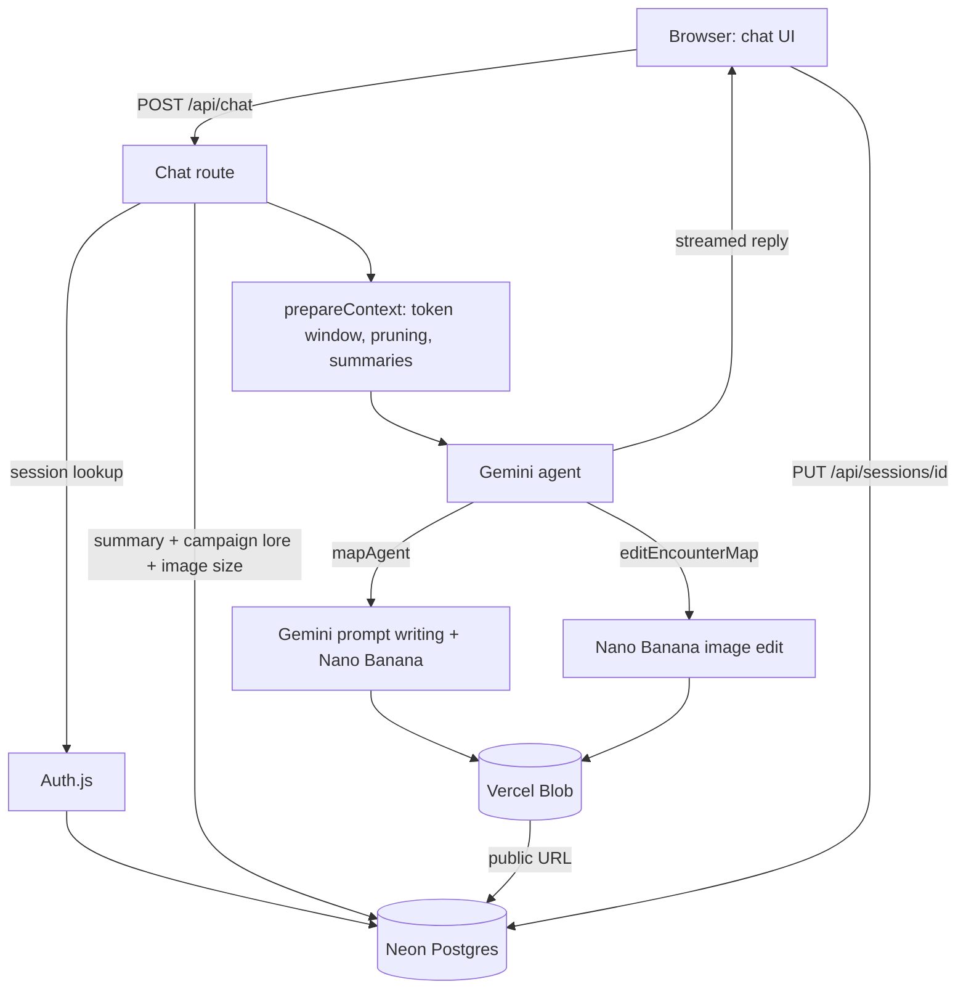

# Fabled Campaigns

[](https://www.fabledcampaigns.com)
[](LICENSE)
[](https://nodejs.org/)
[](https://nextjs.org/)
[](https://cloud.google.com/vertex-ai)
[](https://neon.tech)

> Where Every Tale Rolls a Natural 20

An AI Dungeon Master assistant for tabletop RPGs. You describe what you need in a chat, and it
narrates scenes, generates and edits encounter maps, and keeps sessions and homebrew campaigns
organized.

[Visit www.fabledcampaigns.com](https://www.fabledcampaigns.com)

## Features

### Chat assistant

A Gemini agent plays the role of a D&D 5e Dungeon Master. Replies stream into the chat. Anyone
can chat without an account. Signing in with Google saves sessions, collections, and maps.

### Encounter map generation

Ask for a map in plain language ("a flooded crypt lit by green candles"). If the request names a
location type and a mood, the agent generates the map right away. If one of them is missing, it
asks a single follow-up question with a suggested example.

Generation runs in three steps:

1. Gemini writes a short scene narrative from the request.
2. Gemini expands the narrative into a detailed image prompt.
3. `gemini-3.1-flash-image` (Nano Banana) renders a 4:3 top-down battle map with a tactical grid.
   Nano Banana has no negative-prompt field, so exclusions (people, creatures, text, side views)
   are written directly into the prompt.

Maps can be downloaded as PNG files. Output resolution (1K, 2K, or 4K) is a per-user setting,
changed from the Settings modal in the sidebar footer, and applies to both new maps and edits.

### Map editing

Ask to change a map you already generated ("add a campfire near the stones", "make it night").
The agent sends the source image and the instruction to `gemini-3.1-flash-image` (Nano Banana).
The result is saved as a new version linked to the original, so earlier versions are kept.
Maps generated without a collection have no artifact row, so they are edited by URL instead and are not saved to Collections.

### Collections

A collection is a saved visual theme: terrain, setting, an ambiance preset, and free-text visual
details. While a collection is active, every map generated in the session follows its theme.
Maps are grouped by location inside the collection. Ambiance presets:

Golden twilight, Cold moonlight, Torchlit, Harsh midday, Misty dawn, Eerie glow, Deep night,
Stormy overcast.

### Sessions and campaigns

- Each chat is a session with its full history saved to your account. Sessions can be renamed,
  starred, and deleted, and are listed at `/chat/sessions`.
- Campaigns group sessions. Drag a session onto a campaign in the sidebar, or use the session
  menu. Sessions inside a campaign are numbered in play order.
- Each campaign has an optional lore field (up to 20,000 characters). The lore is added to the
  agent's instructions for every session in that campaign, so narration stays consistent with
  your setting.

### Long-conversation memory

When a conversation approaches about 180k tokens, older messages are summarized into a
structured session memory. The summary is stored with the session and sent to the model in place
of the older messages. The full history stays in the database and in the UI.

### SRD Wiki

Public reference pages for SRD 5.2.1 content, no account required (see [SRD attribution](#srd-attribution)):

- `/wiki/magic-items`: 270 magic items, filterable by name, type, and rarity.
- `/wiki/monsters`: monster stat blocks, filterable by name, type, and challenge rating. The
  dataset currently contains one sample entry.

Every entry has its own statically generated page. The wiki can also be opened in a modal from
inside the app. All wiki pages are included in the sitemap.

### Planned

The agent already exposes `generateCharacter`, `createCampaign`, and `lookupSRD` tools, but they
return placeholder text for now. A campaign chronicle that summarizes past sessions into the
campaign context is designed in [docs/campaigns_feature_plan.md](docs/campaigns_feature_plan.md).

## Tech stack

| Layer | Technology |
|---|---|
| Framework | Next.js 16 (App Router), React 19, TypeScript |
| Styling | Tailwind CSS 4, Cinzel and Roboto fonts via `next/font` |
| AI SDK | Vercel AI SDK 6 (`ai`, `@ai-sdk/react`, `@ai-sdk/google-vertex`) |
| Models (Google Vertex AI) | `gemini-2.5-flash` (chat, prompt writing, summaries), `gemini-3.1-flash-image` (new maps and map edits, Nano Banana, Vertex location `global`) |
| Authentication | Auth.js (`next-auth` v5) with the Google provider and `@auth/pg-adapter` |
| Database | Neon serverless Postgres (`@neondatabase/serverless`) |
| File storage | Vercel Blob (`@vercel/blob`) for map images |
| Markdown | `react-markdown` with `remark-gfm` |
| Hosting | Vercel |

Model names, the image model's Vertex location, and the image-size options are set in
[app/lib/config.ts](app/lib/config.ts). The image model runs in the `global` location
(`GEMINI_IMAGE_LOCATION`), independent of `GOOGLE_CLOUD_LOCATION`, since `gemini-3.1-flash-image`
is not available in `us-central1`.

## Architecture



Neon is used in two ways:

- `db/client.ts` runs all app queries through the Neon HTTP driver, using `DATABASE_URL`. Each
  query is one HTTP request.
- `auth.ts` (the Auth.js adapter) and `db/migrate.ts` open a connection `Pool` on
  `DATABASE_URL_UNPOOLED`.

Vercel Blob stores every generated and edited map as a public file:

- When a collection is active, maps are saved under
  `maps/<collectionId>/<locationId>/<timestamp>-<name>.png` and recorded in the `artifacts`
  table with their Blob URL.
- Without an active collection, maps are saved under `maps/<timestamp>-<name>.png` with no
  database row. These files are not deleted by any cleanup path.
- Deleting an artifact or a collection deletes its Blob files before the database rows.

`proxy.ts` (the Next.js 16 name for middleware) attaches the Auth.js session to every request
except `/auth`, `/api/auth`, `/_next`, and the favicon. It does not block guests. Each API route
checks the session itself.

The chat route has a 300 second limit (`maxDuration = 300`). Map generation and editing must
finish within that time.

## Project structure

```
app/
  api/            Route handlers: chat, sessions, campaigns, collections, locations, artifacts, auth
  auth/sign-in/   Google sign-in page
  chat/           App shell, chat page, sessions page
  components/     Chat, sidebar, modals, wiki components
  lib/            Agent, tools, prompts, context manager, Vertex AI client, config
  wiki/           Public SRD wiki pages
db/
  client.ts       Neon HTTP client
  index.ts        Query functions
  migrate.ts      Schema migration script
  schema/         SQL for auth, user_settings, chat_sessions, campaigns, collections, usage_events
data/             SRD monsters and magic items (JSON)
docs/             Design notes
types/            Wiki and next-auth type declarations
auth.ts           Auth.js configuration
proxy.ts          Request proxy (Auth.js session)
archive/          Previous static site and serverless API, not deployed
```

`archive/` holds the earlier version of the project (form-based map generator). It is kept for
reference only.

## Getting started

### Prerequisites

- Node.js 20.9 or later
- A Google Cloud project with Vertex AI enabled
- A Google OAuth client
- A Neon Postgres database
- A Vercel Blob store (requires a Vercel project)

### 1. Google Cloud and Vertex AI

```bash
# Create and select a project
gcloud projects create your-project-id
gcloud config set project your-project-id

# Enable Vertex AI and IAM
gcloud services enable aiplatform.googleapis.com
gcloud services enable iam.googleapis.com

# Create a service account with Vertex AI access
gcloud iam service-accounts create fabled-campaigns-ai \
  --display-name="Fabled Campaigns AI Service Account"

gcloud projects add-iam-policy-binding your-project-id \
  --member="serviceAccount:fabled-campaigns-ai@your-project-id.iam.gserviceaccount.com" \
  --role="roles/aiplatform.user"

# Download a key file
gcloud iam service-accounts keys create ./service-account.json \
  --iam-account=fabled-campaigns-ai@your-project-id.iam.gserviceaccount.com
```

For local development, point `GOOGLE_APPLICATION_CREDENTIALS` at the key file. For Vercel,
base64-encode it and set `GOOGLE_SERVICE_ACCOUNT_KEY`:

```bash
base64 -i service-account.json
```

Keep `service-account.json` out of version control.

### 2. Google OAuth client

In Google Cloud Console, go to APIs & Services > Credentials and create an OAuth client ID of
type Web application. Add these authorized redirect URIs:

- `http://localhost:3000/api/auth/callback/google`
- `https://<your-domain>/api/auth/callback/google`

Copy the client ID and secret into `AUTH_GOOGLE_ID` and `AUTH_GOOGLE_SECRET`.

### 3. Neon and Vercel Blob

- Neon: create a project. Copy the pooled connection string into `DATABASE_URL` and the direct
  (unpooled) connection string into `DATABASE_URL_UNPOOLED`.
- Vercel Blob: in the Vercel project, open Storage, create a Blob store, and connect it to the
  project. This adds `BLOB_READ_WRITE_TOKEN`.

If both are connected to a Vercel project, `vercel env pull .env.local` downloads their
variables.

### 4. Install and run

```bash
git clone https://github.com/Gal-Gilor/fabled-campaigns.git
cd fabled-campaigns
npm install

cp .env.example .env.local   # then fill in the values
npx auth secret              # writes AUTH_SECRET to .env.local

npm run db:migrate
npm run dev
```

Open http://localhost:3000.

Use `.env.local`, not `.env`. The `db:migrate` and `db:reset` scripts load `.env.local`
explicitly, and it is already in `.gitignore`.

## Environment variables

| Variable | Required | Read by | Purpose |
|---|---|---|---|
| `DATABASE_URL` | Yes | `db/client.ts` | Neon pooled connection string for app queries |
| `DATABASE_URL_UNPOOLED` | Yes | `auth.ts`, `db/migrate.ts` | Neon direct connection for Auth.js and migrations |
| `BLOB_READ_WRITE_TOKEN` | Yes | `@vercel/blob` | Upload and delete map images |
| `AUTH_SECRET` | Yes | Auth.js | Signs and encrypts session tokens |
| `AUTH_GOOGLE_ID` | Yes | Auth.js Google provider | OAuth client ID |
| `AUTH_GOOGLE_SECRET` | Yes | Auth.js Google provider | OAuth client secret |
| `GOOGLE_CLOUD_PROJECT` | Yes | `app/lib/vertexClient.ts` | Vertex AI project ID |
| `GOOGLE_CLOUD_LOCATION` | No | `app/lib/vertexClient.ts` | Vertex AI region, defaults to `us-central1` |
| `GOOGLE_APPLICATION_CREDENTIALS` | Local | Google auth library | Path to the service account JSON file |
| `GOOGLE_SERVICE_ACCOUNT_KEY` | Production | `app/lib/vertexClient.ts` | Base64-encoded service account JSON |

When `GOOGLE_SERVICE_ACCOUNT_KEY` is set, the app uses it and ignores
`GOOGLE_APPLICATION_CREDENTIALS`. When self-hosting outside Vercel behind a proxy, Auth.js may
also need `AUTH_URL` or `AUTH_TRUST_HOST`.

The Neon integration from the Vercel Marketplace also creates `PG*`, `POSTGRES_*`, and `NEON_*`
variables (for example `POSTGRES_URL`, `POSTGRES_PRISMA_URL`, `NEON_PROJECT_ID`,
`NEON_AUTH_BASE_URL`). The app does not read them. It uses Auth.js with its own tables, not Neon
Auth.

`NODE_ENV` does not need to be set. Next.js sets it to `development` for `npm run dev` and
`production` for `npm run build` and `npm start`.

## Database

Tables:

| Table | Purpose |
|---|---|
| `users`, `accounts`, `sessions`, `verification_tokens` | Auth.js |
| `chat_sessions` | Chat history (JSONB), summary, starred flag, campaign link, play order |
| `campaigns` | Campaign name and lore |
| `collections` | Visual themes |
| `collection_sessions` | Links collections to chat sessions (many to many) |
| `locations` | Named maps inside a collection |
| `artifacts` | Map image versions (Blob URL, prompt, parent version) |
| `user_settings` | Per-user map image quality (`1K`, `2K`, `4K`) |
| `usage_events` | Per-request token and image usage, for cost tracking |

Relationships:

- A user owns chat sessions, campaigns, and collections. Deleting a user deletes all of them.
- A chat session belongs to at most one campaign. Deleting a campaign keeps its sessions and
  removes the link.
- A collection has locations, and a location has artifacts. Deleting a collection deletes both.
- An edited artifact points to its source through `parent_artifact_id`.

Migrations are SQL strings in `db/schema/`. Every statement is idempotent (`IF NOT EXISTS`,
`ADD COLUMN IF NOT EXISTS`), so the script can run repeatedly. `db/migrate.ts` runs them in
order: auth, user settings, chat sessions, campaigns, collections, usage events.

| Command | What it does |
|---|---|
| `npm run db:migrate` | Applies the schema using `.env.local` |
| `npm run db:reset` | Drops `artifacts`, `locations`, `collection_sessions`, and `collections`, then migrates. Blob files are not deleted |
| `npm run build` | Runs the migration, then `next build` |

Because the build runs the migration, every Vercel build migrates the database it points to.
If preview deployments share the production database, schema changes reach production with
the first preview build. Neon branching per preview avoids this. See
[docs/campaigns_feature_plan.md](docs/campaigns_feature_plan.md#7-deployment-considerations-vercel--neon--vercel-blob).

## Deployment

The production site runs on Vercel with Neon and Vercel Blob.

1. Import the repository into Vercel. `vercel.json` sets the framework to Next.js.
2. Add the Neon integration from the Vercel Marketplace and connect it to the project.
3. Create a Blob store under Storage and connect it to the project.
4. Add `AUTH_SECRET`, `AUTH_GOOGLE_ID`, `AUTH_GOOGLE_SECRET`, `GOOGLE_CLOUD_PROJECT`,
   `GOOGLE_CLOUD_LOCATION`, and `GOOGLE_SERVICE_ACCOUNT_KEY` in the project settings.
5. Add the production callback URL to the Google OAuth client.
6. Deploy from the dashboard or with `vercel --prod`. The build migrates the database.

Place the Vercel function region close to the Neon region. Every database query is an HTTP
round trip, and the chat route makes one before the model starts responding.

## API reference

All routes except `/api/chat` and `/api/auth/*` return `401` without a signed-in session.
`/api/chat` also works for guests, but nothing is saved.

| Route | Method | Description |
|---|---|---|
| `/api/auth/[...nextauth]` | GET, POST | Auth.js handlers |
| `/api/chat` | POST | Body `{ messages, sessionId?, activeCollection? }`. Streams the agent's reply |
| `/api/sessions` | GET | List the user's sessions |
| | POST | Create a session. Body `{ name? }` |
| `/api/sessions/[id]` | PUT | Update any of `name`, `messages` (array), `starred`, `campaignId` (string or `null`) |
| | DELETE | Delete a session |
| `/api/campaigns` | GET | List the user's campaigns |
| | POST | Create a campaign. Body `{ name, lore? }` |
| `/api/campaigns/[id]` | PUT | Update `name` and/or `lore` |
| | DELETE | Delete a campaign. Its sessions become ungrouped |
| `/api/collections` | GET | Collections linked to a session. Query `?sessionId=` |
| | POST | Create a collection. Body `{ name, terrain?, setting?, ambiance?, visualDetails?, sessionId? }`. With `sessionId`, it is also linked to that session |
| `/api/collections/all` | GET | The user's collections not linked to a session. Query `?excludeSessionId=` |
| `/api/collections/[id]` | PUT | Update a collection |
| | DELETE | Body `{ sessionId, confirmed? }`. See below |
| `/api/collections/[id]/sessions` | POST | Link a collection to a session. Body `{ sessionId }` |
| `/api/collections/[id]/locations` | GET | List a collection's locations |
| `/api/locations` | POST | Create a location. Body `{ id, collectionId, name, sessionId? }` |
| `/api/locations/[id]` | PUT | Rename. Body `{ name }` |
| | DELETE | Delete a location |
| `/api/artifacts` | POST | Record an artifact for an existing Blob URL. Body `{ locationId, blobUrl, prompt?, mediaType? }` |
| `/api/artifacts/[id]` | DELETE | Body `{ blobUrl? }`. Deletes the Blob file, then the row |
| `/api/settings` | GET | Get the signed-in user's map image quality (`1K` for guests) |
| | PATCH | Body `{ imageSize }` (`1K`, `2K`, or `4K`). Updates the setting |

Collection deletion has two steps. Without `confirmed`, if other sessions still use the
collection, only this session's locations, artifacts, and Blob files are removed and the link is
dropped. If no other session uses it, the response is `{ deleted: false, reason:
"requires_confirmation" }`. With `confirmed: true`, the collection and all of its locations,
artifacts, and Blob files are deleted.

### Agent tools

The chat agent has these tools ([app/lib/agents.ts](app/lib/agents.ts)):

| Tool | Status | Description |
|---|---|---|
| `mapAgent` | Live | Generates a new map. Input: `name`, `userRequest`, `perspective`, `detailLevel`, optional `terrain`, `setting`, `collectionId` |
| `editEncounterMap` | Live | Edits a saved map. Input: `sourceArtifactId`, `instruction` |
| `generateCharacter`, `createCampaign`, `lookupSRD` | Placeholder | Return placeholder text |

Both map tools return a JSON string that the chat UI renders as an image card:

```json
{
  "type": "image",
  "src": "<Vercel Blob URL>",
  "label": "<map name>",
  "collectionId": "<id or undefined>",
  "locationId": "<id or undefined>",
  "artifactId": "<id or undefined>",
  "prompt": "<final image prompt>"
}
```

## Security notes

- Sign-in uses Google OAuth through Auth.js. Sessions are stored in Neon.
- Queries for chat sessions, campaigns, and collections filter by the signed-in user's ID. The
  campaign lore lookup only joins campaigns owned by the session's owner.
- Campaign lore is limited to 20,000 characters by the API.
- The Google service account key is read from an environment variable and never committed.
- Map images in Vercel Blob are public. Anyone with a map's URL can view it.
- There is no rate limiting on the chat or map endpoints.

## Troubleshooting

| Symptom | Cause |
|---|---|
| `DATABASE_URL is not set` or `DATABASE_URL_UNPOOLED is not set` | The variable is missing from `.env.local` or the Vercel project. Thrown by `db/client.ts` and `auth.ts` |
| Build fails during migration | `npm run build` runs `db/migrate.ts` first. The build machine must reach the Neon unpooled URL |
| `redirect_uri_mismatch` on sign-in | The callback URL is not listed on the Google OAuth client |
| Auth.js `MissingSecret` error | `AUTH_SECRET` is not set |
| Map generation fails with a Blob error | `BLOB_READ_WRITE_TOKEN` is missing or the Blob store is not connected |
| Vertex AI authentication errors | Check that `GOOGLE_SERVICE_ACCOUNT_KEY` is valid base64, the service account has `roles/aiplatform.user`, and the Vertex AI API is enabled |
| `ENAMETOOLONG` from Google auth on Vercel | `GOOGLE_APPLICATION_CREDENTIALS` holds a base64 string instead of a path. Set `GOOGLE_SERVICE_ACCOUNT_KEY` instead |
| Map request times out | Generation plus editing must finish within the chat route's 300 second limit. Check Vertex AI quotas and region availability |

Server errors appear in the Vercel function logs. Client errors appear in the browser console.

## Further documentation

- [docs/campaigns.md](docs/campaigns.md): campaign data model, API, and lore injection
- [docs/campaigns_feature_plan.md](docs/campaigns_feature_plan.md): campaign design decisions and
  deployment considerations
- [docs/session_management.md](docs/session_management.md): context pipeline and session memory.
  Parts predate the move from SQLite to Neon

## Contributing

1. Fork the repository and create a feature branch.
2. Make your changes.
3. Run `npm run build` to type-check and build. There are no test or lint scripts.
4. Open a pull request.

## License

Copyright © 2025 Fabled Campaigns. All Rights Reserved.

This website, its code, content, and associated materials are proprietary and confidential. Unauthorized copying, distribution, modification, public display, or public performance via any medium is strictly prohibited.

## Acknowledgments

- Google Vertex AI (Gemini) for text and image generation
- Vercel for hosting, Blob storage, and the AI SDK
- Neon for serverless Postgres
- Auth.js for authentication
- The tabletop RPG community for inspiration

### SRD attribution

This work includes material from the System Reference Document 5.2.1 ("SRD 5.2.1") by Wizards of the Coast LLC, available at https://www.dndbeyond.com/srd. The SRD 5.2.1 is licensed under the Creative Commons Attribution 4.0 International License, available at https://creativecommons.org/licenses/by/4.0/legalcode.

The SRD monster and magic item text in `data/` was converted to JSON and reformatted for display in the wiki.
