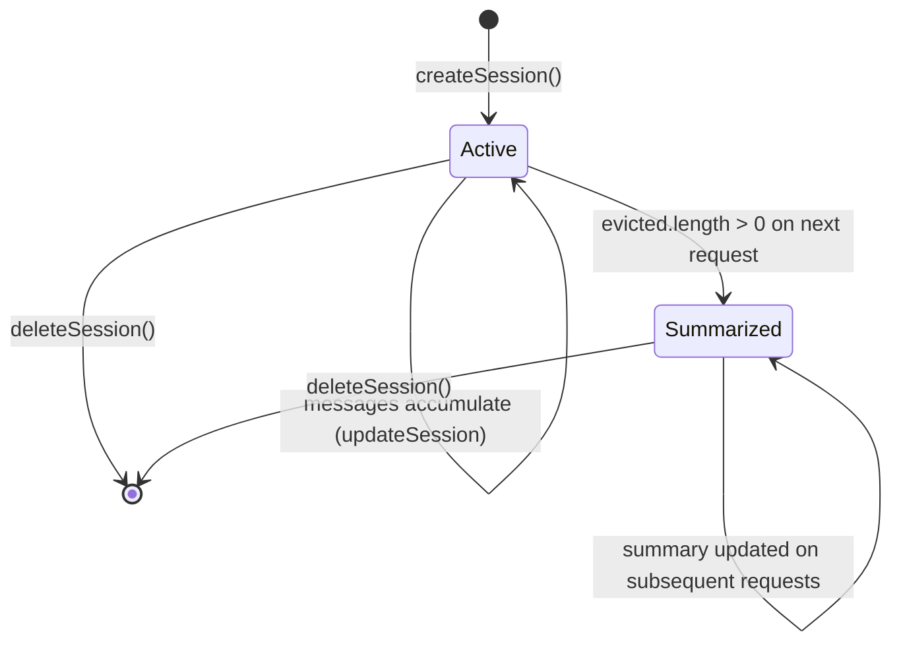
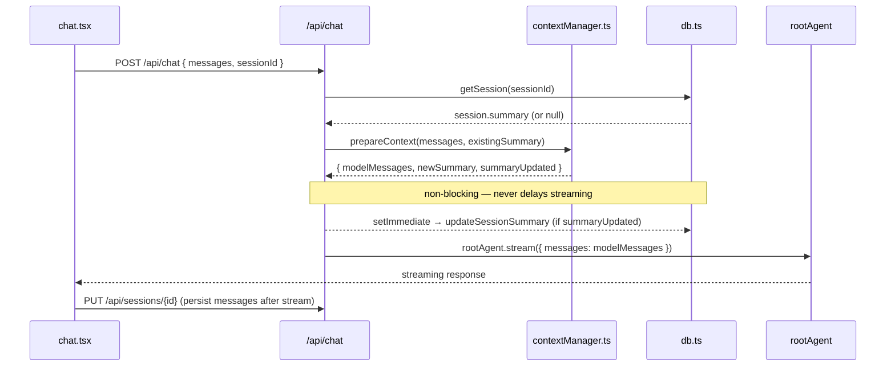

# Session Management

Sessions store the full conversation history in SQLite. On every chat request, the server preprocesses messages before passing them to Gemini — trimming what the model sees without changing what is stored in the database or displayed in the UI.

---

## Database Schema

The database lives at `gm-sessions.db` in the repo root, one directory above `app/`. This keeps it outside Next.js's public directory.

The `sessions` table:

```sql
CREATE TABLE IF NOT EXISTS sessions (
  id          TEXT PRIMARY KEY,        -- UUID
  name        TEXT NOT NULL,
  created_at  INTEGER NOT NULL,        -- Unix timestamp (ms)
  updated_at  INTEGER NOT NULL,        -- Unix timestamp (ms)
  messages    TEXT NOT NULL DEFAULT '[]'  -- JSON-serialized UIMessage[]
);

-- Added via migrations:
ALTER TABLE sessions ADD COLUMN starred INTEGER NOT NULL DEFAULT 0;
ALTER TABLE sessions ADD COLUMN summary TEXT DEFAULT NULL;  -- JSON-serialized SessionMemory
```

`messages` stores the full `UIMessage[]` array as JSON. `summary` stores a `SessionMemory` object as JSON, or `null` if no messages have been evicted yet.

The `starred` and `summary` columns were added after the initial schema. `app/lib/db.ts` adds them with `ALTER TABLE` inside `try/catch` blocks, so the migration is safe to run against an existing database.

```typescript
// app/lib/db.ts
try {
  _db.exec(`ALTER TABLE sessions ADD COLUMN starred INTEGER NOT NULL DEFAULT 0`);
} catch {
  // Column already exists — safe to ignore
}
try {
  _db.exec(`ALTER TABLE sessions ADD COLUMN summary TEXT DEFAULT NULL`);
} catch {
  // Column already exists — safe to ignore
}
```

The `Session` TypeScript interface mirrors the schema:

```typescript
// app/lib/db.ts
export interface Session {
  id: string;
  name: string;
  starred: number;       // 0 or 1
  created_at: number;
  updated_at: number;
  messages: string;      // JSON-serialized UIMessage[]
  summary: string | null;
}
```

### DB functions

| Function | Description |
|---|---|
| `createSession(name?)` | Generates a UUID, inserts a row with an auto-generated date name if none provided |
| `getSession(id)` | Returns the session or `undefined` |
| `listSessions()` | Returns all sessions ordered by `starred DESC, updated_at DESC` |
| `updateSession(id, patch)` | Partial update for `name`, `messages`, or `starred` |
| `updateSessionSummary(id, summary)` | Writes the JSON-serialized `SessionMemory` string |
| `deleteSession(id)` | Removes the row |

---

## Session Lifecycle



A session starts active with no summary. Once the estimated token count of the conversation approaches `TOKEN_EVICTION_THRESHOLD` (180k tokens, 90% of the 200k practical limit), the server evicts the oldest messages and generates a `SessionMemory` summary. Future requests read that summary from the DB and include it at the head of the model context.

---

## Request Flow



The summary write uses `setImmediate` so it never blocks the streaming response. The client sends the full message history on every request; the route handler does not rely on the DB for message retrieval.

---

## Context Pipeline

`prepareContext` in `app/lib/contextManager.ts` runs three phases before passing messages to `rootAgent`.

```mermaid
flowchart TD
  A[UIMessage[] from client] --> B[applyTokenWindow]
  B --> C[recent: messages within token budget]
  B --> D[evicted: older messages]
  C --> E[pruneToolOutputs]
  E --> F[cleaned recent messages]
  D --> G{evicted.length > 0?}
  G -- Yes --> H[summarize via generateObject]
  H --> I[SessionMemory]
  I --> J[renderMemory → markdown block]
  G -- No --> K[skip summarize]
  F --> L[convertToModelMessages]
  J --> M[prepend as user turn]
  M --> N[ModelMessage[] to rootAgent]
  L --> N
  K --> N
```

### Phase 1: applyTokenWindow

```typescript
// app/lib/contextManager.ts
export function applyTokenWindow(
  messages: UIMessage[]
): { recent: UIMessage[]; evicted: UIMessage[] }
```

Walks backward through the message array, accumulating an estimated character count (4 chars/token baseline for Gemini English prose). Messages are added to `recent` until the next one would exceed the budget of `TOKEN_EVICTION_THRESHOLD × 4 − TOKEN_OVERHEAD_RESERVE` characters (~705k chars, ≈176k tokens for conversation content). Everything older goes into `evicted`. If the total fits within the budget, `evicted` is empty. A safety guard ensures `recent` always contains at least the most recent message.

```typescript
// app/lib/contextManager.ts
export function estimateMessageTokens(message: UIMessage): number
```

`estimateMessageTokens` is the underlying estimation function. It counts characters per message part — full text, a fixed 1,000-char proxy for images (to avoid counting raw base64), and capped tool output (2,000 chars max) — then divides by 4. Exported for testing.

### Phase 2: pruneToolOutputs

```typescript
// app/lib/contextManager.ts
export function pruneToolOutputs(messages: UIMessage[]): UIMessage[]
```

Applied to `recent` only. Finds `tool-invocation` parts in state `output-available` and replaces any `data:` base64 image `src` with the string `[image data]`. This strips large image payloads from the model context without losing the tool output structure.

### Phase 3: summarize

```typescript
// app/lib/contextManager.ts
export async function summarize(
  evicted: UIMessage[],
  existingSummary: SessionMemory | null
): Promise<SessionMemory>
```

Called only when `evicted.length > 0`. Serializes the evicted messages to plain text (text parts only, no tool outputs), then calls `generateObject` with `SessionMemorySchema` against the Gemini model. Merges with the existing summary if one is present.

The resulting `SessionMemory` is JSON-serialized for DB storage, then rendered as a markdown block by `renderMemory()` and injected as a `user` turn at the head of the model messages. It's injected as a user turn rather than a system message to avoid multi-system-message issues with Gemini.

---

## Session Memory Schema

```typescript
// app/lib/contextManager.ts
export const SessionMemorySchema = z.object({
  npcs: z.array(z.object({
    name: z.string(),
    description: z.string(),
    relationship: z.enum(['allied', 'hostile', 'neutral', 'unknown']).optional(),
  })).default([]),
  locations: z.array(z.object({
    name: z.string(),
    description: z.string(),
    map_generated: z.boolean().optional(),
  })).default([]),
  quests: z.array(z.object({
    title: z.string(),
    description: z.string(),
    status: z.enum(['active', 'resolved', 'abandoned']).default('active'),
  })).default([]),
  key_decisions: z.array(z.string()).default([]),
  notes: z.string().optional(),
});
```

`npcs` tracks named characters and their relationship to the party. `locations` tracks named places; `map_generated: true` marks any location for which a map was generated during the session. `quests` uses `status` to distinguish active work from resolved or abandoned objectives. `key_decisions` records significant player choices as plain strings. `notes` is a catch-all string, also used when migrating old plain-text summaries to the structured format.

`tryParseMemory` handles backward compatibility: if the stored `summary` is not valid JSON or fails Zod validation, it wraps the raw string as `{ notes: raw }` so the next summarization pass can extract structure from it.

`renderMemory` formats the object as markdown sections. Active quests and resolved/abandoned quests are rendered in separate sections. Locations with `map_generated: true` get a `[map generated]` tag.

---

## Client Wiring

`chat.tsx` attaches `sessionId` to every request using a `DefaultChatTransport` with a `body` callback:

```typescript
// app/components/chat.tsx
const transport = useMemo(
  () => new DefaultChatTransport({
    api: CHAT_API_PATH,
    body: () => ({ sessionId: activeSessionIdRef.current }),
  }),
  []
);
```

`activeSessionIdRef` is a ref, not state. The `body` callback reads the ref at call time, so the transport does not need to be recreated when the user switches sessions. If it were state-based, every session switch would create a new transport and trigger a re-render of the `useChat` hook.

The ref stays in sync via a `useEffect`:

```typescript
useEffect(() => {
  activeSessionIdRef.current = activeSessionId;
}, [activeSessionId]);
```

After streaming completes (`status === 'ready'`), the client persists the updated message array to the DB via `PUT /api/sessions/{id}`.

---

## Configuration

| Constant | Value | Description |
|---|---|---|
| `TOKEN_LIMIT` | `200_000` | Practical token cap for a conversation (Gemini 2.5 Flash supports 1M) |
| `TOKEN_EVICTION_THRESHOLD` | `180_000` | Token count at which summarization triggers (90% of `TOKEN_LIMIT`) |
| `TOKEN_OVERHEAD_RESERVE` | `15_000` | Characters reserved for system prompt, tool schemas, summary block, and response headroom |
| `GEMINI_MODEL` | `'gemini-2.5-flash'` | Model used for both chat and summarization |

All are exported from `app/lib/config.ts`.

---

## Error Handling

Summarization failure is caught inside `prepareContext`. The error is logged and the pipeline continues without a new summary:

```typescript
// app/lib/contextManager.ts
const summaryPromise = evicted.length > 0
  ? summarize(evicted, parsedSummary).catch((err) => {
      console.error('[contextManager] summarize failed, proceeding without summary:', err);
      return null;
    })
  : Promise.resolve(null);
```

If `sessionId` is missing from the request, the route skips the DB lookup and passes `null` as `existingSummary`. The window and prune phases still run.

DB write failures on summary persistence are also caught and logged. The `setImmediate` callback has a `try/catch` that never re-throws, so a failed write does not affect the streaming response. The next request will attempt to generate and persist the summary again.
